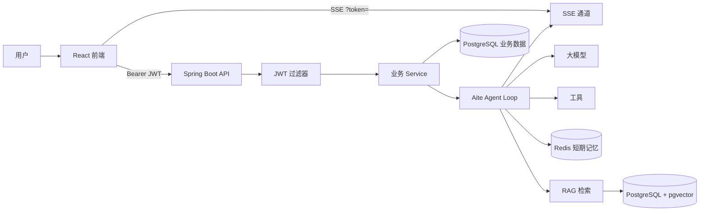

# Aite Agent

<div align="center">
  <h3>面向智能体应用的全栈 AI Chat 平台</h3>
  <p>
    <strong>Spring AI Agent Loop</strong> ·
    <strong>RAG 知识库</strong> ·
    <strong>JWT 鉴权</strong> ·
    <strong>多租户隔离</strong> ·
    <strong>SSE 流式响应</strong>
  </p>
  <p>
    
    
    
    
    
  </p>
</div>

**Aite Agent**（前端品牌名 **Aite助手**）是一个基于 Spring Boot、Spring AI 和 React 的智能体聊天系统。它围绕 Agent Loop、工具调用、知识库检索、上下文记忆、用户鉴权与实时响应构建，适合用于学习 AI Agent 后端架构、RAG 链路、多模型接入与多租户 SaaS 式数据隔离。

> 仓库地址：[github.com/Zzhi66/aite_Agent](https://github.com/Zzhi66/aite_Agent)

## 项目亮点

- **Agent Loop**：支持思考、执行、工具调用、状态流转和最大轮次控制。
- **RAG 知识库**：Markdown 上传、解析、分块、Embedding 入库与 pgvector 相似度检索。
- **长短期记忆**：Redis 保存近期对话；PostgreSQL + pgvector 沉淀用户偏好与事实记忆。
- **JWT 鉴权与多租户**：注册/登录、双 Token 刷新；Agent、会话、知识库按 `user_id` 隔离。
- **多模型接入**：DeepSeek、智谱 AI、OpenAI 兼容接口。
- **工具系统**：文件系统、邮件、任务终止等可扩展工具。
- **实时体验**：SSE 推送 Agent 状态与流式回复；前端 React + Ant Design。

## 架构概览



## 核心能力

### 用户鉴权与数据隔离

- `app_user` 用户表，密码 **BCrypt** 存储。
- **Access Token**（默认 1h）+ **Refresh Token**（默认 7d）。
- 业务表（`agent`、`chat_session`、`knowledge_base` 等）通过 `user_id` 过滤，防止越权访问。

### 智能体对话

- 创建与管理智能体，配置提示词、模型、工具与知识库。
- 多轮上下文与历史会话恢复。

### 知识库与 RAG

- 知识库、文档、分块管理；Markdown 向量化与 pgvector 召回。

### 记忆系统

- Redis：近期对话窗口与摘要。
- 长期记忆：抽取偏好/事实，按相似度注入后续对话。

## 技术栈

| 层级 | 技术 |
|------|------|
| 后端 | Java 17、Spring Boot 3.5、Spring AI 1.1、Spring Security、JWT (jjwt)、MyBatis |
| 数据 | PostgreSQL、pgvector、Redis |
| 前端 | React 19、TypeScript、Vite、Ant Design 6、Tailwind CSS |
| 模型 | DeepSeek、智谱 AI、OpenAI 兼容接口 |

## 项目结构

```text
aite_Agent/
├── README.md
└── JChatMind-main/
    ├── jchatmind/                    # Spring Boot 后端
    │   ├── src/main/java/.../
    │   │   ├── agent/                # Agent 核心流程
    │   │   ├── controller/           # REST API（含 AuthController）
    │   │   ├── security/             # JWT、SecurityConfig、UserContext
    │   │   ├── service/              # 业务门面
    │   │   └── mapper/               # MyBatis
    │   └── long-term-memory-ddl.sql
    ├── ui/                           # React 前端（登录页、AiteAgent 布局）
    └── jchatmind_sql/                # 初始化 SQL
        └── jchatmind_assert/
            └── auth_migration.sql    # 用户表与 user_id 迁移
```

## 快速开始

以下命令默认在仓库根目录执行；路径以 `JChatMind-main/` 为前缀。

### 1. 环境要求

- JDK 17+、Maven 3.8+、Node.js 20+
- PostgreSQL 14+（扩展 `vector`、`pgcrypto`）
- Redis 6+

### 2. 初始化数据库

```sql
CREATE DATABASE jchatmind;
```

```bash
psql -U postgres -d jchatmind -f JChatMind-main/jchatmind_sql/jchatmind.sql
psql -U postgres -d jchatmind -f JChatMind-main/jchatmind/long-term-memory-ddl.sql
psql -U postgres -d jchatmind -f JChatMind-main/jchatmind_sql/jchatmind_assert/auth_migration.sql
```

> `auth_migration.sql` 会创建 `app_user` 表，并为业务表添加 `user_id` 列，**鉴权功能必须执行此脚本**。

### 3. 配置后端

在 `JChatMind-main/jchatmind/src/main/resources/application.yaml` 中配置（勿提交真实密钥）：

| 配置项 | 说明 |
|--------|------|
| `spring.datasource` | PostgreSQL 连接 |
| `spring.data.redis` | Redis 连接 |
| `spring.ai.*` | 模型 API Key |
| `jchatmind.auth.jwt-secret` | JWT 签名密钥（生产环境用环境变量 `JWT_SECRET`） |
| `jchatmind.auth.access-token-expiration` | Access Token 有效期（毫秒，默认 3600000） |
| `jchatmind.auth.refresh-token-expiration` | Refresh Token 有效期（毫秒，默认 604800000） |
| `jchatmind.memory.*` | 短/长期记忆策略 |

示例：

```yaml
jchatmind:
  auth:
    jwt-secret: ${JWT_SECRET:your-256-bit-secret-key-change-in-production}
    access-token-expiration: 3600000
    refresh-token-expiration: 604800000
```

### 4. 启动后端

```bash
cd JChatMind-main/jchatmind
mvn spring-boot:run
```

健康检查：`GET http://localhost:8080/health`

### 5. 启动前端

```bash
cd JChatMind-main/ui
npm install
npm run dev
```

浏览器访问 Vite 地址（通常 `http://localhost:5173`）：

1. 首次进入 **登录页**（`/login`），注册并登录。
2. 登录成功后进入主界面，可创建智能体、知识库并开始对话。
3. Token 保存在浏览器 `localStorage`，刷新页面无需重复登录。

## API 说明

### 认证（无需 Token）

| 方法 | 路径 | 说明 |
|------|------|------|
| POST | `/api/auth/register` | 注册 `{ username, password, nickname? }` |
| POST | `/api/auth/login` | 登录，返回 `accessToken`、`refreshToken` |
| POST | `/api/auth/refresh` | 刷新 Token `{ refreshToken }` |

### 认证（需要 Bearer Token）

| 方法 | 路径 | 说明 |
|------|------|------|
| GET | `/api/auth/me` | 当前用户信息 |
| GET | `/api/agents` | 当前用户的智能体列表 |
| POST | `/api/agents` | 创建智能体 |
| GET | `/api/chat-sessions` | 聊天会话列表 |
| POST | `/api/chat-messages` | 发送消息 |
| GET | `/api/knowledge-bases` | 知识库列表 |
| POST | `/api/documents/upload` | 上传文档（multipart） |
| GET | `/api/tools` | 可选工具列表 |

请求头示例：

```http
Authorization: Bearer <accessToken>
```

### SSE 实时连接

`EventSource` 无法设置自定义 Header，需通过 **Query Param** 传 Token：

```text
GET /sse/connect/{chatSessionId}?token=<accessToken>
```

## 开发命令

```bash
# 后端编译
cd JChatMind-main/jchatmind && mvn -DskipTests compile

# 后端测试
cd JChatMind-main/jchatmind && mvn test

# 前端开发 / 构建
cd JChatMind-main/ui && npm run dev
cd JChatMind-main/ui && npm run build
cd JChatMind-main/ui && npm run lint
```

## 安全说明

- **不要**将 `.env`、`application.yaml` 或真实 API Key 提交到公开仓库。
- 生产环境请使用强随机 `JWT_SECRET`，并通过环境变量注入。
- 迁移前产生的历史数据 `user_id` 可能为空，仅新注册用户数据会完整隔离。
- 公开仓库建议仅保留示例配置，敏感信息走 CI/CD 密钥或私有配置。

## 后续规划

- [ ] SSE 服务端 Token 校验与会话归属校验完善
- [ ] 知识库文档重建索引
- [ ] 工具调用审计日志
- [ ] Docker Compose 一键启动
- [ ] 更多 OpenAI 兼容模型供应商

## License

如需开源协议，请在仓库中补充 `LICENSE` 文件。
