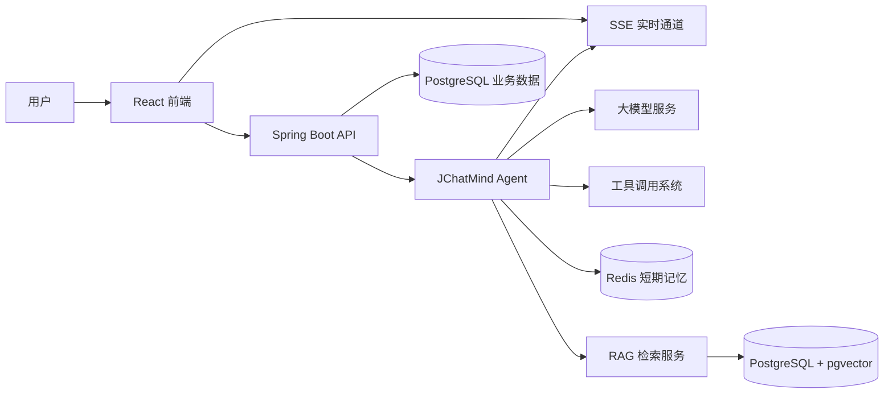

# JChatMind

<div align="center">
  <h3>面向智能体应用的全栈 AI Chat 平台</h3>
  <p>
    <strong>Spring AI Agent Loop</strong> ·
    <strong>RAG 知识库</strong> ·
    <strong>长期记忆</strong> ·
    <strong>SSE 流式响应</strong>
  </p>
  <p>
    
    
    
    
    
  </p>
</div>

JChatMind 是一个基于 Spring Boot、Spring AI 和 React 的智能体聊天系统。它不只是“调用一次大模型接口”的聊天框，而是围绕 Agent Loop、工具调用、知识库检索、上下文记忆和实时响应构建的一套完整 AI 应用工程。

项目适合用于学习和展示 AI Agent 后端架构、RAG 检索链路、多模型接入、前后端实时通信，以及面向真实业务的记忆系统设计。

## 项目亮点

- Agent Loop：支持思考、执行、工具调用、状态流转和最大轮次控制，让模型可以完成多步骤任务。
- RAG 知识库：支持 Markdown 文档上传、解析、分块、Embedding 入库和 pgvector 相似度检索。
- 长短期记忆：Redis 保存近期对话上下文，PostgreSQL + pgvector 沉淀用户偏好和事实记忆。
- 多模型接入：通过统一注册与调用方式接入 DeepSeek、智谱 AI 和 OpenAI 兼容接口。
- 工具系统：内置文件系统、邮件、任务终止等工具，并保留扩展新工具的结构。
- 实时体验：使用 SSE 向前端推送 Agent 执行状态和模型回复，用户可以看到任务进展。
- 前后端分离：后端提供 RESTful API 和 SSE 通道，前端使用 React、Vite、Ant Design 构建交互界面。

## 架构概览



## 核心能力

### 智能体对话

- 支持创建和管理不同 Agent。
- 支持为 Agent 配置提示词、模型参数、工具和知识库。
- 支持多轮上下文恢复，让模型能够结合历史对话继续回答。

### 知识库与 RAG

- 支持知识库、文档和文档分块管理。
- 支持 Markdown 内容解析和向量化存储。
- 使用 PostgreSQL + pgvector 完成向量召回，降低部署复杂度。

### 记忆系统

- Redis 用于保存近期聊天窗口和摘要结果。
- 长期记忆会从用户输入中抽取偏好和事实，并在后续对话中按相似度召回。
- 可通过配置控制长期记忆抽取数量、召回范围、注入数量和注入提示词。

### 工具调用

- Agent 可以在推理过程中调用后端工具。
- 工具执行结果会回写到对话上下文，辅助模型继续规划。
- 新增工具时只需遵循现有工具注册模式，核心 Agent 流程无需大改。

## 技术栈

后端技术：

- Java 17
- Spring Boot 3.5
- Spring AI 1.1
- MyBatis
- PostgreSQL
- pgvector
- Redis
- Lombok

前端技术：

- React 19
- TypeScript
- Vite
- Ant Design 6
- Tailwind CSS

模型与能力：

- DeepSeek
- 智谱 AI
- OpenAI 兼容接口
- Embedding 向量检索
- SSE 服务端推送

## 项目结构

```text
JChatMind-main/
├── jchatmind/
│   ├── src/main/java/com/kama/jchatmind/
│   │   ├── agent/              # Agent 核心执行流程
│   │   ├── controller/         # REST API 和 SSE 接口
│   │   ├── service/            # 业务服务、RAG、记忆、工具门面
│   │   ├── mapper/             # MyBatis 数据访问层
│   │   └── model/              # DTO、Entity、Request、Response、VO
│   ├── src/main/resources/
│   │   └── mapper/             # MyBatis XML 映射文件
│   └── long-term-memory-ddl.sql# 长期记忆表和索引脚本
├── ui/                         # React 前端应用
└── jchatmind_sql/              # 项目初始化 SQL
```

## 快速开始

### 1. 准备环境

请先安装以下环境：

- JDK 17+
- Maven 3.8+
- Node.js 20+
- PostgreSQL 14+
- Redis 6+
- PostgreSQL 扩展 `vector` 和 `pgcrypto`

### 2. 初始化数据库

```sql
CREATE DATABASE jchatmind;
```

```bash
psql -U postgres -d jchatmind -f jchatmind_sql/jchatmind.sql
psql -U postgres -d jchatmind -f jchatmind/long-term-memory-ddl.sql
```

### 3. 配置后端

在本地创建或修改 `jchatmind/src/main/resources/application.yaml`，配置数据库、Redis、邮箱和模型 API Key。

请不要提交真实密钥。建议在生产环境通过环境变量、密钥管理服务或私有配置文件注入敏感信息。

关键配置包括：

- `spring.datasource`：PostgreSQL 数据库连接。
- `spring.data.redis`：Redis 连接。
- `spring.ai.*`：模型供应商和 API Key。
- `jchatmind.query-rewrite`：查询重写开关和模型。
- `jchatmind.memory.redis`：短期记忆窗口、摘要阈值和缓存时间。
- `jchatmind.memory.long-term`：长期记忆抽取、召回和注入策略。

### 4. 启动后端

```bash
cd jchatmind
mvn spring-boot:run
```

健康检查：

```text
GET http://localhost:8080/health
```

### 5. 启动前端

```bash
cd ui
npm install
npm run dev
```

前端启动后，按终端输出的 Vite 地址访问页面。

## 常用接口

- `GET /api/agents`：查询智能体列表。
- `POST /api/agents`：创建智能体。
- `GET /api/chat-sessions`：查询聊天会话。
- `POST /api/chat-sessions`：创建聊天会话。
- `GET /api/chat-messages/session/{sessionId}`：查询会话消息。
- `POST /api/chat-messages`：发送用户消息。
- `GET /api/knowledge-bases`：查询知识库。
- `POST /api/documents/upload`：上传知识库文档。
- `GET /api/tools`：查询可选工具。
- `GET /sse/connect/{chatSessionId}`：建立 SSE 实时连接。

## 开发命令

后端编译：

```bash
cd jchatmind
mvn -DskipTests compile
```

后端测试：

```bash
cd jchatmind
mvn test
```

前端开发：

```bash
cd ui
npm run dev
```

前端构建：

```bash
cd ui
npm run build
```

前端代码检查：

```bash
cd ui
npm run lint
```

